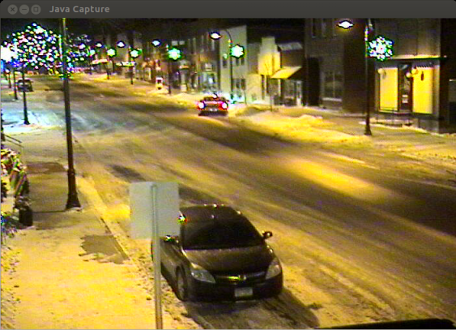
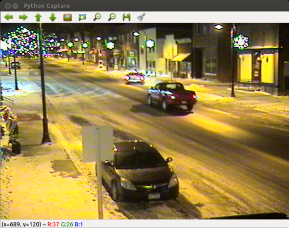

## Install OpenCV

Typically to get the latest version of OpenCV you have to build it from source.
In order to automate this process I've put together a script that installs
the necessary prerequisites and builds OpenCV with Java and Python bindings. I
also included example source, so you can test the installation.

### OpenCV 3.0.0

I created a branch [2_4_9_0](https://github.com/sgjava/install-opencv/tree/2_4_9_0)
since that's the last stable build script before OpenCV 3.0.0.

The master branch now builds OpenCV 3.0.0 from GitHub, so you can consider this experimental
until the OpenCV build is release quality. TBB is now thanks to a
[bug](http://code.opencv.org/issues/3900) I reported. The suggested cmake arguments worked.
I also answered my own [question](http://answers.opencv.org/question/40544/opencv-300-alpha-build-failure-with-tbb)
if you are interested.
Need to do:
* Finish TBB testing on ARM.

### WARNING

This script has the ability to install/remove Ubuntu packages and it also
installs some libraries from source. This could potentially screw up your system
(if it's not a fresh install), so use with caution! I suggest using a VM for
testing before using it on your physical systems. I tried to make the defaults
sane in config.sh.

### Provides
* FFMPEG from source (x264, fdk-aac, libvpx, libopus)
* OpenCV from source
    * Patch libjpeg to mute common warnings that will fill up the logs.
* Java 8 and Apache Ant
    * Patch gen_java.py to generate missing VideoWriter class, add some missing CV_CAP_PROP constants and replace protected finalize() method with public delete() 
    * Patch OpenCV classes with memory leaks as I find them. All finalize methods replaced with delete.
    * FourCC class
    * CaptureUI Applet to view images/video since there's no imshow with the bindings
* Java and Python examples
    * Capture UI
    * Motion detection
    * People detection
    
### Platforms Supported by Install OpenCV
* Ubuntu 12.04.4 LTS x86_64
* Ubuntu 12.04.4 LTS x86
* Ubuntu 12.04.4 LTS armv7l
* Ubuntu 14.04.1 LTS x86_64
* Ubuntu 14.04.1 LTS x86
* Ubuntu 14.04.1 LTS armv7l

### Build
* On ARM platforms with limited memory create a swap file or the build may fail
with an out of memory exception. To create a 1GB swap file use:
    * `sudo su -`
    * `dd if=/dev/zero of=tmpswap bs=1024 count=1M`
    * `mkswap tmpswap`
    * `swapon tmpswap`
    * `free`
* On ARM WebM codec (libvpx) failed to build because due to "Requested CPU
 'cortex-a8' not supported by compiler" even though I tested it on a
 Cortex-A9. For now the install script doesn't build WebM on ARM.
* `git clone https://github.com/sgjava/install-opencv.git`
* `cd install-opencv/scripts/ubuntu`
* Edit config.sh and change OpenCV and Java versions as needed
* Run script in foreground or background
    * `sudo ./install.sh` to run script in foreground
    * `sudo sh -c 'nohup ./install.sh &'` to run script in background

#### Build times (Note not all make build jobs run in parallel)
* Acer AM3470G-UW10P Desktop
    * AMD A6-3620 quad core
    * 2.20GHz, 4MB Cache
    * 8GB DIMM DDR3 Synchronous 1333 MHz
    * 500GB WDC WD5000AAKX-0 SATA 3 7200 RPM 16MB Cache
    * Ubuntu 12.04.3 LTS x86_64
    * ~30 minutes (depends on download latency)
* MK808 mini PC
    * Rockchip RK3066 dual core
    * 1.6GHz Cortex-A9 (set to 1.5 GHz)
    * 1GB DDR3
    * 32GB SDHC Class 10
    * Ubuntu 14.04
    * ~3 hours (depends on download latency)
* MK802IV mini PC
    * Rockchip RK3188 quad core
    * 1.6GHz Cortex-A9 (set to 1.2 GHz)
    * 2GB DDR3
    * 32GB SDHC Class 10
    * Ubuntu 14.04
    * ~2 hours (depends on download latency)

#### Build output
* Check install.log output for any problems with the installation script.
* Dependent libraries `/home/<username>/opencv-2.4.x-libs`
* OpenCV home `/home/<username>/opencv-2.4.x`
* Java and Python bindings `/home/<username>/opencv-2.4.x/build`

#### Upgrades
The install script will remove the previously installed packages with `dpkg -r`.
To upgrade OpenCV follow the build instructions after doing:
* `sudo su -`
* `cd /home/<username>/opencv-2.4.x/build`
* `make uninstall`
* `exit`

### Java
To run Java programs in Eclipse you need add the OpenCV library.
* Window, Preferences, Java, Build Path, User Libraries, New..., OpenCV, OK
* Add External JARs..., /home/&lt;username&gt;/opencv-2.4.x/build-java/bin/opencv-24x.jar
* Native library location, Edit..., External Folder..., /home/&lt;username&gt;/opencv-2.4.x/build/lib, OK
* Right click project, Properties, Java Build Path, Libraries, Add Library..., User Library, OpenCV, Finish, OK
* Import [Eclipse project](https://github.com/sgjava/install-opencv/tree/master/opencv-java)

To run compiled class (Canny for this example) from shell:
* `cd /home/<username>/workspace/install-opencv/opencv-java`
* `java -Djava.library.path=/home/<username>/opencv-2.4.x/build/lib -cp /home/<username>/opencv-2.4.x/build/bin/opencv-24x.jar:bin com.codeferm.opencv.Canny`

#### Things to be aware of
* There's no bindings generated for OpenCV's GPU module.
* Missing VideoWriter (I fixed this by patching gen_java.py)
* Constants are missing (These can by patched as well in the install script)
* There's no imshow equivalent, so check out [CaptureUI](https://github.com/sgjava/install-opencv/blob/master/opencv-java/src/com/codeferm/opencv/CaptureUI.java)
* Make sure you call Mat.release() followed by Mat.delete() to free native memory



#### How to check for native memory leaks
Since the OpenCV Java bindings wrap OpenCV's C++ libraries there's opportunities
for native memory to leak without being able to detect it from Java (jmap/jhat).
The Java bindings make use of the finalize method which is generally bad practice.
I have removed all of these via patching. Some of the bindings create new Mat
objects and subclasses of Mat without calling Mat.release() and Mat.delete(). This
will cause native memory leaks and I'm patching these as they are encountered. The
real fix is for the code to be corrected, so patching is not required. I have
submitted bugs regarding the memory leaks, but until the code is fixed patching is
the only cure. These are the steps required to analyze a Java program using OpenCV (or any
JNI based app). 
* Install Valgrind and the Valkyrie GUI
    * `sudo apt-get install valgrind valkyrie`
* Profile application
    * `cd /home/<username>/workspace/install-opencv/opencv-java`
    * `valgrind --trace-children=yes --leak-check=full --num-callers=15 --xml=yes --xml-file=/home/<username>/canny.xml java -Djava.compiler=NONE -Djava.library.path=/home/<username>/opencv-2.4.x/build/lib -cp /home/<username>/opencv-2.4.x/build/bin/opencv-24x.jar:bin com.codeferm.opencv.Canny`
* Examine Valgrind output
    * `valkyrie`
    * Open canny.xml
    * Scroll down to bottom
    * Look for OpenCV classes which ar wrapped by Java such as `0x1FDD0BFE: Java_org_opencv_imgproc_Imgproc_findContours_11 (in /home/<username>/opencv-2.4.x/build/lib/libopencv_java24x.so)` This will give you a hint which Java class is leaking memory. There's always a chance it could by a memory leak in the C++ code which would require patching the C++ source.
    
The Canny example is slightly faster in Java (3.08 seconds) compared to Python
(3.18 seconds). In general, there's not enough difference in processing over 900
frames to pick one set of bindings over another for performance reasons.
`-agentlib:hprof=cpu=samples` is used to profile.
```
Input file: ../resources/traffic.mp4
Output file: ../output/canny-java.avi
Resolution: 480x360
919 frames
Elipse time: 3.03 seconds

CPU SAMPLES BEGIN (total = 310) Fri Jan  3 16:09:24 2014
rank   self  accum   count trace method
   1 40.32% 40.32%     125 300218 org.opencv.imgproc.Imgproc.Canny_0
   2 22.58% 62.90%      70 300220 org.opencv.highgui.VideoWriter.write_0
   3 10.00% 72.90%      31 300215 org.opencv.highgui.VideoCapture.read_0
   4  9.03% 81.94%      28 300219 org.opencv.core.Core.bitwise_and_0
   5  9.03% 90.97%      28 300221 org.opencv.imgproc.Imgproc.cvtColor_1
   6  5.81% 96.77%      18 300222 org.opencv.imgproc.Imgproc.GaussianBlur_2
   7  0.32% 97.10%       1 300016 sun.misc.Perf.createLong
   8  0.32% 97.42%       1 300077 java.util.zip.ZipFile.open
   9  0.32% 97.74%       1 300095 java.util.jar.JarVerifier.<init>
  10  0.32% 98.06%       1 300102 java.lang.ClassLoader$NativeLibrary.load
  11  0.32% 98.39%       1 300105 java.util.Arrays.copyOfRange
  12  0.32% 98.71%       1 300163 sun.nio.fs.UnixNativeDispatcher.init
  13  0.32% 99.03%       1 300212 sun.reflect.ReflectionFactory.newConstructorAccessor
  14  0.32% 99.35%       1 300214 org.opencv.highgui.VideoCapture.VideoCapture_1
  15  0.32% 99.68%       1 300216 java.util.Arrays.copyOfRange
  16  0.32% 100.00%       1 300217 com.codeferm.opencv.Canny.main
CPU SAMPLES END
```
### Python
To run Python programs in Eclipse you need [PyDev](http://pydev.org) installed.
* Help, Install New Software..., Add..., Name: PyDev, Location: http://pydev.org/updates, OK, check PyDev, Next>, Next>, I accept the terms of the license agreement, Finish, Trust certificate, OK
* Import [Eclipse project](https://github.com/sgjava/install-opencv/tree/master/opencv-python)



`-m cProfile -s time` is used to profile.
```
Input file: ../../resources/traffic.mp4
Output file: ../../output/canny-python.avi
Resolution: 480x360
919 frames
Elapse time: 3.18 seconds

   Ordered by: internal time

   ncalls  tottime  percall  cumtime  percall filename:lineno(function)
      919    1.231    0.001    1.231    0.001 {cv2.Canny}
      919    0.932    0.001    0.932    0.001 {method 'write' of 'cv2.VideoWriter' objects}
      920    0.375    0.000    0.375    0.000 {method 'read' of 'cv2.VideoCapture' objects}
      919    0.230    0.000    0.230    0.000 {cv2.bitwise_and}
      919    0.188    0.000    0.188    0.000 {cv2.cvtColor}
      919    0.175    0.000    0.175    0.000 {cv2.GaussianBlur}
        1    0.075    0.075    3.263    3.263 Canny.py:6(<module>)
        1    0.007    0.007    0.007    0.007 {cv2.VideoCapture}
      262    0.003    0.000    0.004    0.000 function_base.py:3181(add_newdoc)
        2    0.003    0.001    0.012    0.006 __init__.py:2(<module>)
        1    0.002    0.002    0.003    0.003 polynomial.py:48(<module>)
        1    0.002    0.002    0.003    0.003 chebyshev.py:78(<module>)
        1    0.002    0.002    0.003    0.003 hermite_e.py:50(<module>)
        6    0.002    0.000    0.003    0.000 {method 'sub' of '_sre.SRE_Pattern' objects}
        1    0.002    0.002    0.003    0.003 hermite.py:50(<module>)
        1    0.002    0.002    0.003    0.003 legendre.py:74(<module>)
```
### FreeBSD License
Copyright (c) Steven P. Goldsmith

All rights reserved.

Redistribution and use in source and binary forms, with or without modification, are permitted provided that the following conditions are met:
* Redistributions of source code must retain the above copyright notice, this list of conditions and the following disclaimer.
* Redistributions in binary form must reproduce the above copyright notice, this list of conditions and the following disclaimer in the documentation and/or other materials provided with the distribution.

THIS SOFTWARE IS PROVIDED BY THE COPYRIGHT HOLDERS AND CONTRIBUTORS "AS IS" AND ANY EXPRESS OR IMPLIED WARRANTIES, INCLUDING, BUT NOT LIMITED TO, THE IMPLIED WARRANTIES OF MERCHANTABILITY AND FITNESS FOR A PARTICULAR PURPOSE ARE DISCLAIMED. IN NO EVENT SHALL THE COPYRIGHT HOLDER OR CONTRIBUTORS BE LIABLE FOR ANY DIRECT, INDIRECT, INCIDENTAL, SPECIAL, EXEMPLARY, OR CONSEQUENTIAL DAMAGES (INCLUDING, BUT NOT LIMITED TO, PROCUREMENT OF SUBSTITUTE GOODS OR SERVICES; LOSS OF USE, DATA, OR PROFITS; OR BUSINESS INTERRUPTION) HOWEVER CAUSED AND ON ANY THEORY OF LIABILITY, WHETHER IN CONTRACT, STRICT LIABILITY, OR TORT (INCLUDING NEGLIGENCE OR OTHERWISE) ARISING IN ANY WAY OUT OF THE USE OF THIS SOFTWARE, EVEN IF ADVISED OF THE POSSIBILITY OF SUCH DAMAGE.
